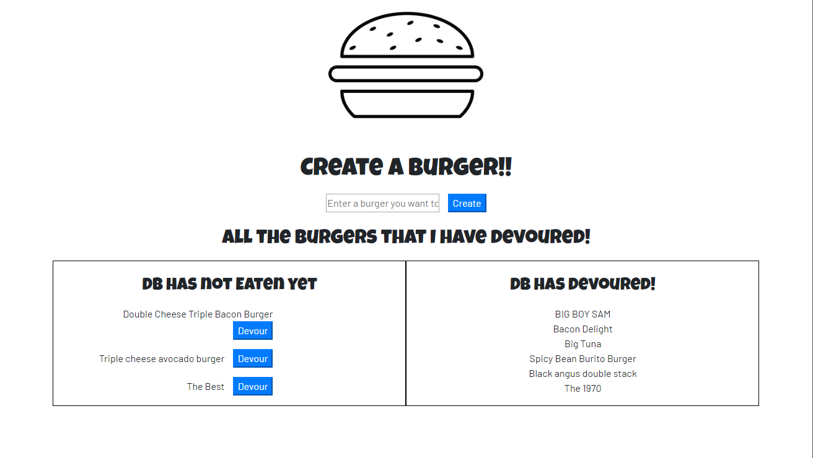
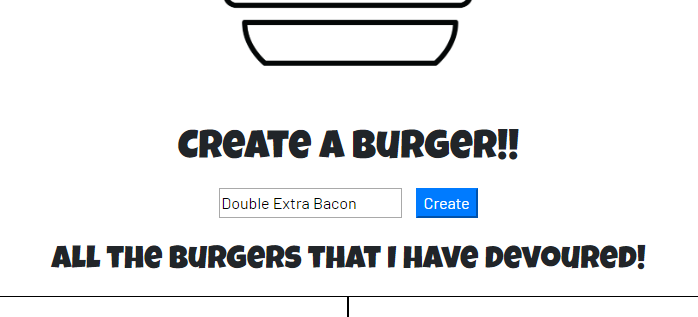
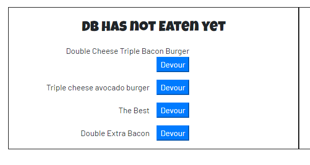
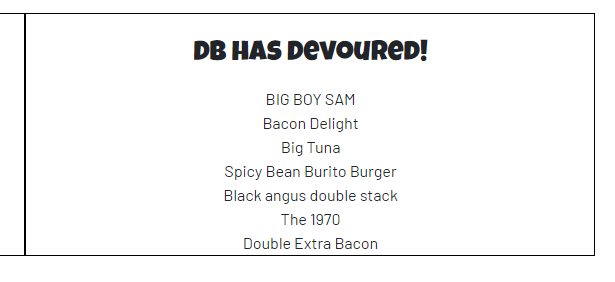

# 13-homework
This is a full stack application that takes data from the user and sends it to a data base using controllers and an express server. The goal of this app is to showcase woring with MySql database and full stack development. Also make up cool names for burgers.

--- 
### To start working on computer

First you will need to clone the repo.  
```
git clone git@github.com:Ruffmantom/13-homework.git

```
---
### Make sure you have some way to connect to MySql database and run this in your SQL editor
```
CREATE DATABASE burgers_db;

USE burgers_db;

CREATE TABLE burgers(
    burger_id int auto_increment NOT NULL,
    burger_name VARCHAR(50),
    devoured boolean,
    primary key(burger_id)
)
```
### To Start the app
```
npm install
npm start

```
### Once the app is running You will get this screen.


### To add a burger, type into the input and click Create.Then you will see it pop up in the list below on the left.

---


### If you click on devour, it will change the key in the schema to true and move the item over to the right side list.


--- 
### Making the Eat-da-burger app. 

Well this was a super tough HW. The first half of getting the DB connected and setting up the ORM was nice I felt confident in what I was writing.
Then came the model and the controllers this got me stumped for hours just trying to figure out where to start. I used the cat exercise as a template and that was really the only way I could figure it out. Im still feeling fuzzy with how models work and how to wright the controller. adding errors or the routes are still tough. Glad its finished tho. 

## App working
[Heroku app](https://sheltered-journey-59778.herokuapp.com/)
Heroku app with a database is not fun to set up so this link might not work.

## Youtube Video of it working
[App working video](https://youtu.be/UrJ8oKjvkxw)

---
## License
Tom Ruff - [RuffWD](http://www.ruffwd.tech/)
